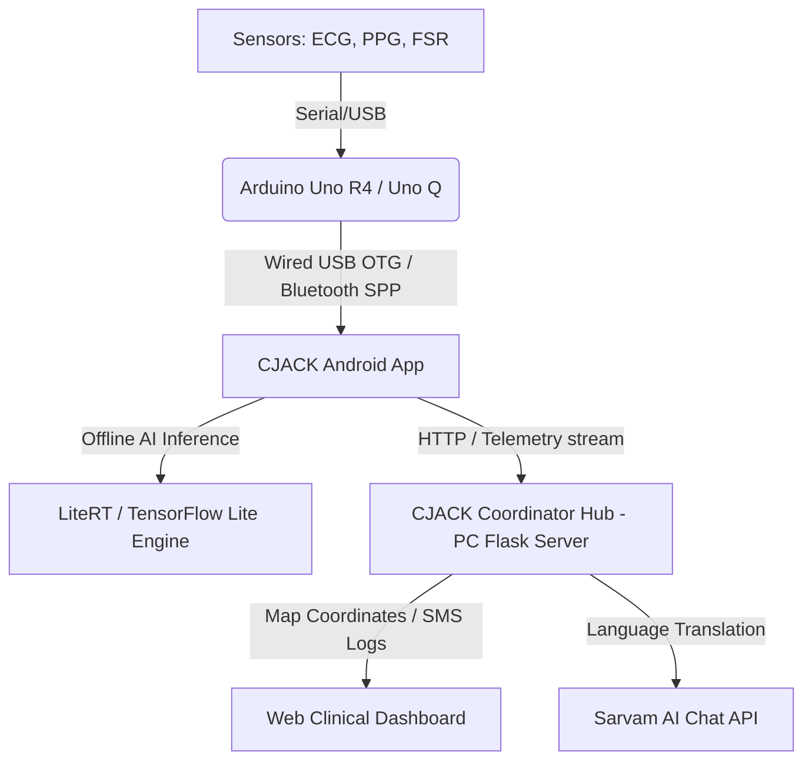

# CJACK AI: Advanced Emergency Coordination & Clinical Monitoring System

CJACK AI is a high-accuracy, offline-capable emergency coordination system designed to monitor patient vitals in real-time, provide AI-driven clinical guidance (in multiple languages), and coordinate local coordinate/ambulance response routes. 

The system leverages a hybrid hardware-software architecture to support CPR feedback, automatic emergency broadcast logs (SMS/calls), and live coordinate visualization.

---

## 🏗️ System Architecture



---

## 🔌 Hardware Configuration

The system is configured to receive physical telemetry from an **Arduino Uno R4 WiFi** (or Uno Q) connected to a patient sensor array:

*   **Pulse Sensor (PPG):** Analogue input on pin **`A2`** to capture real-time blood photoplethysmogram inputs.
*   **AD8232 ECG Sensor:** Analogue input on pin **`A0`**, with Lead-Off status triggers mapped to digital pins **`10` (LO+)** and **`11` (LO-)**.
*   **FSR (Force Resistor):** Analogue input on pin **`A1`** to capture manual CPR compression forces.

### Telemetry Output
Data is parsed locally and transmitted as a structured single-line JSON string at a rate of 10Hz (every 100ms) over Serial at **9600 Baud**:
```json
{"heartRate":72,"pulse":512,"spo2":98,"ecg":512,"force":342,"status":"NORMAL"}
```

---

## 📱 Android Application (AI Node)

Located in `/app`, the Android application acts as the primary data receiver and AI evaluator.

### Key Features:
*   **Dual-Core Connection Driver:** Built using the `usb-serial-for-android` driver to support plug-and-play **USB-C to USB-C direct connection** from the Arduino Uno R4 (toggling DTR/RTS) with instant hot-plug triggers, alongside Bluetooth Classic (SPP) fallback.
*   **Edge AI Inference:** Uses Google's **LiteRT (TensorFlow Lite)** engine running local, offline inferences to diagnose cardiac status and evaluate CPR compression efficacy on-device.
*   **Emergency Dispatch Actions:** Programmed to trigger automated, parallel SMS and Phone Calls directly to configured emergency contacts when a Cardiac Arrest state is verified.

---

## 🖥️ Clinician Hub Server & Dashboard

The clinician server is written in Python using Flask and is located in the root repository folder (`/helphub_server.py`).

### Key Features:
*   **Clinician Dashboard UI:** High-accuracy Leaflet map plotting active patient geolocation, ambulance routing coordinates, and clinical vital trends.
*   **Sarvam AI Integration:** Performs dynamic translation of clinician advisory recommendations into Hindi and Tamil in real-time.
*   **Simulation Loop:** Includes an ambulance movement simulation background thread that maps real-time dispatch progress.

---

## 🚀 Getting Started

### 1. Build the Android Application
1. Open Android Studio.
2. Select **File > Open** and choose the root directory of this repository (`C:\dcj1`).
3. Let Gradle sync dependencies.
4. Set your custom Google Maps API key in `local.properties`:
   ```properties
   MAPS_API_KEY=your_google_maps_api_key
   ```
5. Click **Run** to compile and deploy on your smartphone.

### 2. Run the Coordinator Web Server
Ensure you have Python installed, then set up the server:
```bash
# Install dependencies
pip install Flask requests pyserial

# Run the emergency server
python helphub_server.py
```
Open **`http://localhost:8080`** in your browser to view the clinical coordinator command board.

### 3. Connection Modes
*   **Simulation Mode:** Built-in for testing without hardware. Toggle it **ON** in the App Settings to generate synthetic telemetry immediately.
*   **Wired Mode:** Plug a USB-C to USB-C cable directly from your phone to the Arduino Uno R4 WiFi. Toggle Simulation Mode **OFF** in settings to stream physical sensors.

---

## 📁 Repository Structure

```
├── app/                      # Native Kotlin Jetpack Compose Android Project
│   ├── src/main/java/        # Android controller logic and UI screens
│   └── src/main/res/         # Vector graphics and XML layouts
├── cjack_sensor_node.ino     # Arduino sensor node source code
├── helphub_server.py         # Flask Web coordinator and dashboard server
├── build.gradle.kts          # Top-level dependencies configuration
└── README.md                 # Project handbook
```
