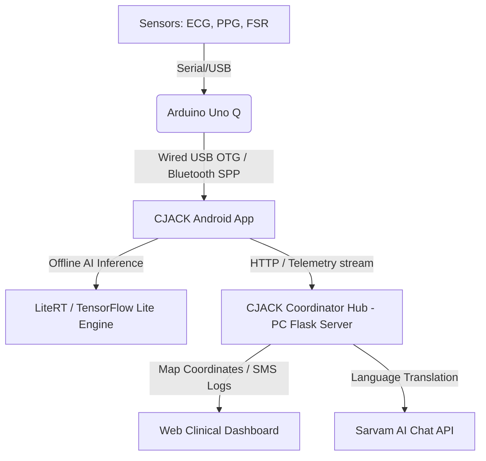

# CJACK AI: Emergency Coordination & Sensor Monitoring

CJACK AI is an emergency assistant system that monitors patient vital signs in real-time, provides AI-guided CPR advice, and coordinates dispatch routes for emergency responses.

---

## 🏗️ System Overview



---

## 🔌 Hardware Setup

The system receives real-time vital telemetry from the **Arduino Uno Q**:

*   **Pulse Sensor:** Connected to Analog Pin **`A2`** (Measures Heart Rate/PPG).
*   **AD8232 ECG Sensor:** Connected to Analog Pin **`A0`**, with Lead-off pins on Pins **`10` (LO+)** and **`11` (LO-)**.
*   **FSR (Force Resistor):** Connected to Analog Pin **`A1`** (Measures CPR Compression Force).

### Data Format
The Arduino transmits data over Serial (**9600 Baud**) as a single-line JSON string:
```json
{"heartRate":72,"spo2":98,"ecg":512,"force":342,"status":"NORMAL"}
```

---

## 📱 Android App Features

*   **Direct USB C-to-C Connection:** Supported out-of-the-box (uses `usb-serial-for-android` to interface directly with the Arduino Uno Q).
*   **Bluetooth SPP Support:** Optional wireless pairing fallback.
*   **On-Device AI Guidance:** Evaluates CPR compressions offline using **LiteRT (TensorFlow Lite)**.
*   **Auto SOS Calls/SMS:** Sends simultaneous automated emergency alerts and calls to contacts in a crisis.

---

## 🖥️ PC Hub & Dashboard Server

The clinician dashboard runs locally using a Python Flask server (`helphub_server.py`).

*   **Live Tracking:** Shows patient GPS coordinates and maps the ambulance's route.
*   **Multilingual Guide:** Translates emergency instructions into English, Hindi, and Tamil using the **Sarvam AI API**.
*   **Ambulance Simulation:** Simulates direct, step-by-step dispatch navigation progress.

---

## 🚀 How to Try It

### Step 1: Run the Android App
1. Open the project folder `C:\dcj1` in **Android Studio**.
2. Put your Google Maps Key in `local.properties`:
   ```properties
   MAPS_API_KEY=your_key_here
   ```
3. Run the app on your phone.

### Step 2: Start the Web Dashboard
Run the Python server on your computer:
```bash
# Install requirements
pip install Flask requests pyserial

# Start the local server
python helphub_server.py
```
Open **`http://localhost:8080`** in your computer’s browser.

### Step 3: Choose Connection Mode
*   **Simulation Mode:** Go to settings in the mobile app and turn **ON** *Simulation Mode* to test with synthetic data.
*   **Hardware Mode:** Connect the Arduino to your phone, turn **OFF** *Simulation Mode*, and allow USB permission.
